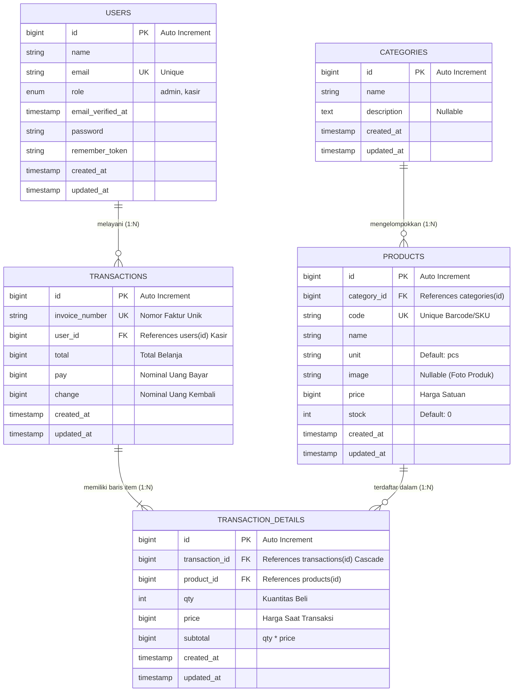

# LAPORAN DAN JAWABAN TUGAS PRAKTIKUM
## Mata Kuliah: Pemrograman Web Berbasis Framework
### Studi Kasus: POS (Point of Sale) Barokah Mart — Laravel 13

---

## DAFTAR ISI
1. [Pertemuan 1: Pendahuluan dan Instalasi Laravel](#pertemuan-1-pendahuluan-dan-instalasi-laravel)
2. [Pertemuan 2: Arsitektur Laravel, Struktur Folder, dan Routing](#pertemuan-2-arsitektur-laravel-struktur-folder-dan-routing)
3. [Pertemuan 3: Environment, Migration, dan Perancangan Database POS](#pertemuan-3-environment-migration-dan-perancangan-database-pos)

---

## PERTEMUAN 1: PENDAHULUAN DAN INSTALASI LARAVEL

### Ringkasan Praktikum
- **Nama Project**: `pos_toko`
- **Framework**: Laravel 13.x (PHP 8.3+)
- **Database**: MySQL (`pos_toko`) via Laragon
- **Asset Bundler**: Vite + Tailwind CSS v4 (`@tailwindcss/vite`)
- **Konfigurasi Environment**: File `.env` telah disesuaikan untuk koneksi MySQL dan nama aplikasi `POS Barokah Mart`.

---

### Jawaban Latihan Pertemuan 1

#### 1. Jelaskan dengan kata-kata sendiri peran Model, View, dan Controller pada konteks aplikasi POS Barokah Mart.

| Komponen | Peran dalam Arsitektur MVC | Contoh Nyata pada Aplikasi POS Barokah Mart |
| :--- | :--- | :--- |
| **Model** | Mengelola logika bisnis, manipulasi data, aturan validasi data, serta komunikasi langsung ke database melalui Eloquent ORM. | Model `Product` mengelola stok barang dan harga jual, Model `Category` mengelompokkan jenis produk, dan Model `Transaction` mengelola catatan penjualan serta pengurangan stok saat checkout. |
| **View** | Menampilkan antarmuka pengguna (UI) dan menyajikan data kepada user menggunakan template engine Blade dan styling Tailwind CSS. | `welcome.blade.php`, `dashboard.blade.php`, layar form input barang, tabel daftar produk, dan layar kasir POS tempat kasir memilih barang dan mencetak struk transaksi. |
| **Controller** | Bertindak sebagai penghubung (jembatan) antara request pengguna (dari Route), memanggil fungsi di Model, lalu mengembalikan data hasil olahan ke View. | `ProductController` menangani request simpan barang baru, dan `DashboardController` mengambil ringkasan total penjualan harian dari database lalu mengirimkannya ke tampilan dashboard kasir/admin. |

---

#### 2. Lakukan instalasi project pos-toko di komputer masing-masing, sertakan tangkapan layar halaman selamat datang Laravel yang berhasil tampil di browser.

**Status Instalasi:**
- Project telah selesai diinstal di direktori: `c:\laragon\www\pos_toko`
- Lingkungan Pengembangan yang digunakan:
  - **PHP**: `8.3.30`
  - **MySQL**: `8.4.3` (Laragon)
  - **Composer**: `v2.x`
  - **Node.js**: `v24.18.0` / **NPM**: `11.16.0`
- Server dapat dijalankan dengan perintah:
  ```bash
  composer run dev
  # Atau secara terpisah:
  php artisan serve
  npm run dev
  ```
- Aplikasi dapat diakses melalui browser pada URL: `http://127.0.0.1:8000` atau `http://localhost:8000`.

---

#### 3. Menurut Anda, kenapa Laravel 13 memisahkan starter kit (React/Vue/Livewire) dari instalasi dasar, padahal Laravel versi-versi sebelumnya menawarkan Breeze sebagai starter kit Blade yang ringan?

**Penjelasan:**
1. **Fleksibilitas dan Kode Bersih (Clean Baseline)**: Laravel 13 memberikan instalasi dasar yang sangat ringan (minimalis) tanpa membebani developer dengan pustaka UI, dependensi JavaScript tambahan, atau arsitektur SPA yang mungkin tidak dibutuhkan untuk proyek tertentu.
2. **Evolusi Ekosistem Frontend**: Ekosistem starter kit resmi modern di Laravel 13 telah berkembang menggunakan kombinasi teknologi tingkat lanjut seperti Inertia v2 dengan shadcn/ui, Vue, React, atau Livewire Flux. Memisahkan opsi ini memastikan developer dapat memilih stack yang benar-benar sesuai kebutuhan tanpa ada file mubazir.
3. **Fokus pada Fondasi Pemrograman**: Dalam konteks pembelajaran dan praktikum, ketiadaan starter kit memaksa mahasiswa memahami alur autentikasi, layout Blade, routing, dan penanganan session dari dasar secara manual (Pertemuan 4 & 5), sehingga mahasiswa tidak sekadar mewarisi kode scaffolding bawaan yang tidak dipahami cara kerjanya.

---

## PERTEMUAN 2: ARSITEKTUR LARAVEL, STRUKTUR FOLDER, DAN ROUTING

### Ringkasan Praktikum
1. **Pembuatan Controller**: `DashboardController` dibuat menggunakan Artisan:
   ```bash
   php artisan make:controller DashboardController --resource
   ```
2. **Implementasi Method `index()`**: Mengembalikan tampilan `resources/views/dashboard.blade.php`:
   ```php
   public function index()
   {
       return view('dashboard');
   }
   ```
3. **Pendaftaran Rute**:
   - `/dashboard` dengan middleware `auth` dan route name `dashboard`.
   - `/about` dengan closure profil toko (Tugas Latihan No. 2).

---

### Jawaban Latihan Pertemuan 2

#### 1. Gambarkan dalam bentuk tabel peta rute tambahan yang menurut Anda dibutuhkan, misalnya untuk mengelola data supplier.

Berikut adalah rancangan Resource Route untuk modul manajemen Supplier pada sistem POS Barokah Mart:

| HTTP Verb | URI / Path | Route Name | Action Method | Deskripsi Fungsi | Hak Akses |
| :--- | :--- | :--- | :--- | :--- | :--- |
| **GET** | `/suppliers` | `suppliers.index` | `SupplierController@index` | Menampilkan tabel daftar seluruh supplier distributor barang | Admin |
| **GET** | `/suppliers/create` | `suppliers.create` | `SupplierController@create` | Menampilkan halaman formulir pendaftaran supplier baru | Admin |
| **POST** | `/suppliers` | `suppliers.store` | `SupplierController@store` | Menyimpan data supplier baru ke database setelah divalidasi | Admin |
| **GET** | `/suppliers/{id}` | `suppliers.show` | `SupplierController@show` | Menampilkan detail supplier beserta riwayat pasokan barangnya | Admin |
| **GET** | `/suppliers/{id}/edit` | `suppliers.edit` | `SupplierController@edit` | Menampilkan formulir untuk memperbarui data supplier | Admin |
| **PUT/PATCH** | `/suppliers/{id}` | `suppliers.update` | `SupplierController@update` | Menyimpan perubahan data supplier ke database | Admin |
| **DELETE** | `/suppliers/{id}` | `suppliers.destroy` | `SupplierController@destroy` | Menghapus data supplier dari database | Admin |
| **GET** | `/suppliers/{id}/purchases` | `suppliers.purchases` | `SupplierController@purchases` | Menampilkan riwayat nota pembelian / kulakan dari supplier terkait | Admin |

---

#### 2. Buat rute /about dengan Closure sederhana yang menampilkan teks profil toko, tanpa Controller.

**Implementasi pada `routes/web.php`:**
```php
Route::get('/about', function () {
    return 'Profil Toko POS Barokah Mart: Toko kelontong yang melayani kebutuhan sembako, minuman, makanan ringan, dan kebutuhan rumah tangga sehari-hari dengan sistem digital modern.';
});
```

**Hasil Pengujian:**
- Mengakses `http://127.0.0.1:8000/about` mengembalikan teks profil toko secara langsung dengan HTTP Status `200 OK`.

---

#### 3. Jelaskan perbedaan `Route::get()` dan `Route::post()`, berikan contoh kasus pemakaian masing-masing di aplikasi POS.

| Karakteristik | `Route::get()` | `Route::post()` |
| :--- | :--- | :--- |
| **Tujuan Utama** | Mengambil / meminta data dari server tanpa mengubah state atau data di database (Safe & Idempotent). | Mengirimkan data baru ke server untuk disimpan, diproses, atau memicu perubahan data (Non-Idempotent). |
| **Pengiriman Data** | Melalui URL query parameter (terlihat di address bar browser). | Melalui HTTP Request Body (tersembunyi dan terenkripsi jika menggunakan HTTPS). |
| **Keamanan Data** | Kurang aman untuk data sensitif, memiliki batasan panjang URL. | Aman untuk data sensitif, dilengkapi token keamanan `@csrf` bawaan Laravel. |
| **Contoh Kasus di POS Barokah Mart** | 1. Membuka halaman kasir POS (`/pos`).<br>2. Menampilkan katalog data produk (`/products`).<br>3. Filter pencarian barang berdasarkan nama atau barcode (`/products?search=beras`). | 1. Menyimpan transaksi penjualan kasir dan mengurangi stok produk (`/pos/checkout`).<br>2. Menyimpan data master barang baru (`/products`).<br>3. Memproses autentikasi form login admin/kasir (`/login`). |

---

## PERTEMUAN 3: ENVIRONMENT, MIGRATION, DAN PERANCANGAN DATABASE POS

### Ringkasan Praktikum
Telah dibuat dan dieksekusi 6 berkas migrasi ke database MySQL `pos_toko`:
1. `add_role_to_users_table`: Menambahkan kolom enum `role` (`admin`, `kasir`) default `kasir` setelah kolom `email`.
2. `create_categories_table`: Tabel kategori produk (`id`, `name`, `description`, `timestamps`).
3. `create_products_table`: Tabel produk (`id`, `category_id` FK, `code` unique, `name`, `unit`, `price`, `stock`, `timestamps`).
4. `create_transactions_table`: Tabel transaksi (`id`, `invoice_number` unique, `user_id` FK, `total`, `pay`, `change`, `timestamps`).
5. `create_transaction_details_table`: Tabel detail transaksi (`id`, `transaction_id` FK cascade, `product_id` FK, `qty`, `price`, `subtotal`, `timestamps`).
6. `CategorySeeder`: Berhasil menginputkan 4 kategori awal ('Sembako', 'Minuman', 'Makanan Ringan', 'Kebutuhan Rumah Tangga').

---

### Jawaban Latihan Pertemuan 3

#### 1. Tambahkan kolom image (nullable) pada tabel products lewat migration baru.

**Berkas Migrasi:** `database/migrations/xxxx_add_image_to_products_table.php`

**Kode Migrasi:**
```php
<?php

use Illuminate\Database\Migrations\Migration;
use Illuminate\Database\Schema\Blueprint;
use Illuminate\Support\Facades\Schema;

return new class extends Migration
{
    public function up(): void
    {
        Schema::table('products', function (Blueprint $table) {
            $table->string('image')->nullable()->after('unit');
        });
    }

    public function down(): void
    {
        Schema::table('products', function (Blueprint $table) {
            $table->dropColumn('image');
        });
    }
};
```

**Verifikasi Database:**
Kolom `image` berjenis `VARCHAR(255)` dengan izin `NULL` berhasil ditambahkan di antara kolom `unit` dan `price` pada tabel `pos_toko.products`.

---

#### 2. Buat ERD (Entity Relationship Diagram) dari kelima tabel yang sudah dibuat.

Berikut adalah diagram relasi entitas (ERD) lengkap dari skema database POS Barokah Mart:



**Deskripsi Relasi Antar Tabel:**
1. **`users` -> `transactions` (One-to-Many)**: Satu user (kasir/admin) dapat memproses banyak transaksi penjualan, namun tiap satu transaksi dicatat oleh satu user kasir.
2. **`categories` -> `products` (One-to-Many)**: Satu kategori dapat menaungi banyak produk. Jika kategori dihapus, produk di bawahnya ikut terhapus (`cascadeOnDelete`).
3. **`transactions` -> `transaction_details` (One-to-Many)**: Satu transaksi struk belanja memiliki satu atau banyak baris item belanjaan. Jika transaksi dihapus, baris detailnya ikut terhapus (`cascadeOnDelete`).
4. **`products` -> `transaction_details` (One-to-Many)**: Satu produk dapat muncul di berbagai transaksi belanja pelanggan yang berbeda.

---

#### 3. Jelaskan apa yang terjadi kalau `php artisan migrate:rollback` dijalankan setelah seluruh migration di bab ini dieksekusi.

**Penjelasan Lengkap:**
1. **Mekanisme Operasi Rollback**:
   Perintah `php artisan migrate:rollback` bekerja dengan mengeksekusi method `down()` pada setiap file migrasi yang termasuk dalam **batch migrasi terakhir** yang tersimpan di tabel `migrations`.
2. **Efek Eksekusi pada Kondisi Terakhir**:
   - Jika dijalankan tepat setelah seluruh langkah selesai, maka migrasi batch terakhir (yaitu `xxxx_add_image_to_products_table`) akan dibatalkan. Method `down()` akan mengeksekusi `$table->dropColumn('image')`, sehingga kolom `image` pada tabel `products` akan dihapus dari database.
3. **Efek Jika Dilakukan Rollback Seluruh Batch (atau Menggunakan Rollback Bertahap)**:
   - Apabila dilakukan rollback pada migrasi tabel-tabel utama (`transaction_details`, `transactions`, `products`, `categories`, dan `add_role_to_users_table`), Laravel akan memanggil method `down()` dengan urutan terbalik dari penciptaannya:
     1. Menghapus tabel `transaction_details` (`Schema::dropIfExists('transaction_details')`).
     2. Menghapus tabel `transactions` (`Schema::dropIfExists('transactions')`).
     3. Menghapus tabel `products` (`Schema::dropIfExists('products')`).
     4. Menghapus tabel `categories` (`Schema::dropIfExists('categories')`).
     5. Menghapus kolom `role` dari tabel `users` (`$table->dropColumn('role')`).
4. **Dampak terhadap Integritas Data**:
   - Seluruh data yang tersimpan di dalam tabel-tabel tersebut (seperti 4 baris data kategori hasil seeder `CategorySeeder`) akan **terhapus secara permanen**.
   - Foreign key constraint tidak akan mengalami error saat drop karena tabel child (`transaction_details`) dihapus sebelum tabel parent (`transactions` dan `products`).
